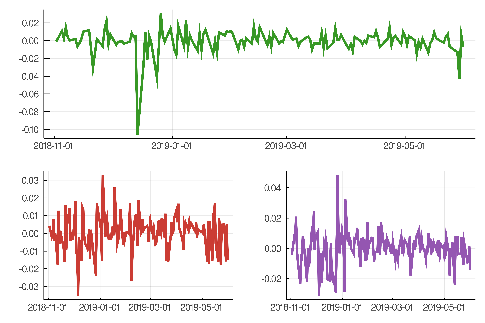
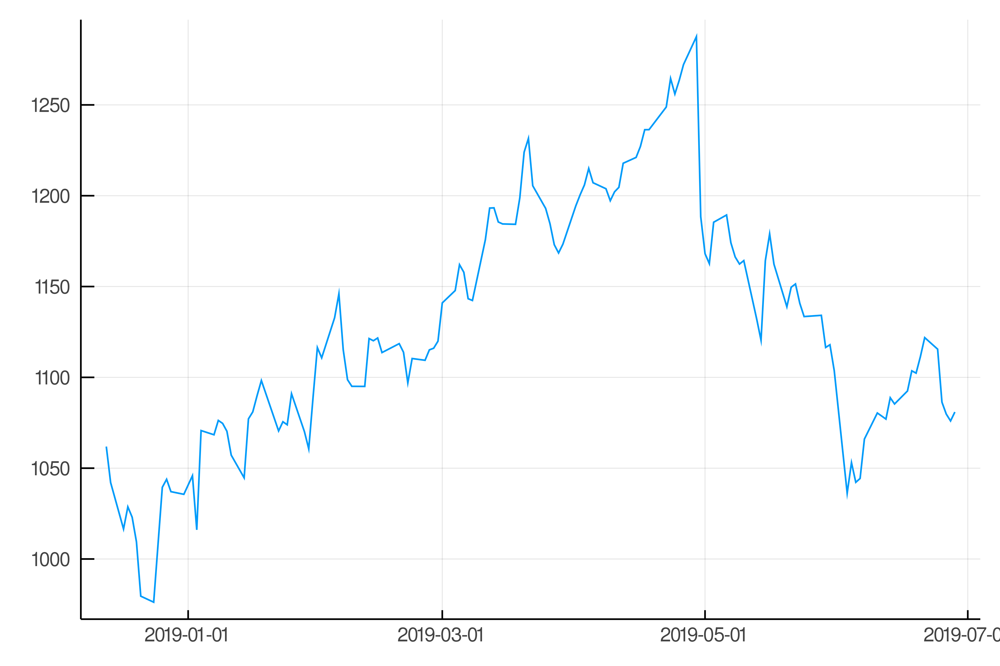

# YahooFinance.jl



`YahooFinance.jl` offers the possibility to access the Yahoo Finance market data in Julia.
This package is available in Python as [pyahoofinance](https://github.com/markushhh/pyahoofinance/) and in R as [YahooFinance](https://github.com/markushhh/YahooFinance/).
It was inspired by [quantmod in R](https://cran.r-project.org/web/packages/quantmod/quantmod.pdf "Documentation") but differs in its method to download the data.

## Installation

```@julia
] add YahooFinance
```

or

```@julia
] add https://github.com/markushhh/YahooFinance.jl
```

## Usage

Load the package and retrieve a time series from Yahoo Finance.

```@julia
using YahooFinance

x = get_symbols("GOOG", "2018-12-13", "2019-06-28")
```

```@julia
136×6 TimeArray{Any,2,Date,Array{Any,2}} 2018-12-13 to 2019-06-28
│            │ Open      │ High    │ Low       │ Close   │ Volume  │ Adjusted │
├────────────┼───────────┼─────────┼───────────┼─────────┼─────────┼──────────┤
│ 2018-12-13 │ 1068.0699 │ 1079.76 │ 1053.9301 │ 1061.9  │ 1329800 │ 1061.9   │
│ 2018-12-14 │ 1049.98   │ 1062.6  │ 1040.79   │ 1042.1  │ 1686600 │ 1042.1   │
│ 2018-12-17 │ 1037.51   │ 1053.15 │ 1007.9    │ 1016.53 │ 2385400 │ 1016.53  │
│ 2018-12-18 │ 1026.09   │ 1049.48 │ 1021.44   │ 1028.71 │ 2192500 │ 1028.71  │
│ 2018-12-19 │ 1033.99   │ 1062.0  │ 1008.05   │ 1023.01 │ 2479300 │ 1023.01  │
│ 2018-12-20 │ 1018.13   │ 1034.22 │ 996.36    │ 1009.41 │ 2673500 │ 1009.41  │
│ 2018-12-21 │ 1015.3    │ 1024.02 │ 973.69    │ 979.54  │ 4596000 │ 979.54   │
│ 2018-12-24 │ 973.9     │ 1003.54 │ 970.11    │ 976.22  │ 1590300 │ 976.22   │
│ 2018-12-26 │ 989.01    │ 1040.0  │ 983.0     │ 1039.46 │ 2373300 │ 1039.46  │
   ⋮
│ 2019-06-19 │ 1105.6    │ 1107.0  │ 1093.48   │…
```

```@julia
using Plots

plot(x["Close"], legend = false)
```



## Notes

- Commodities are not yet supported

# Each comment, suggestion or pull request is welcome!
